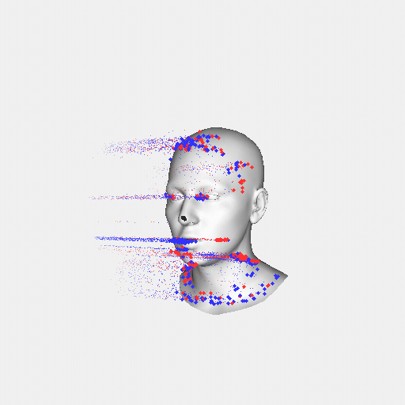
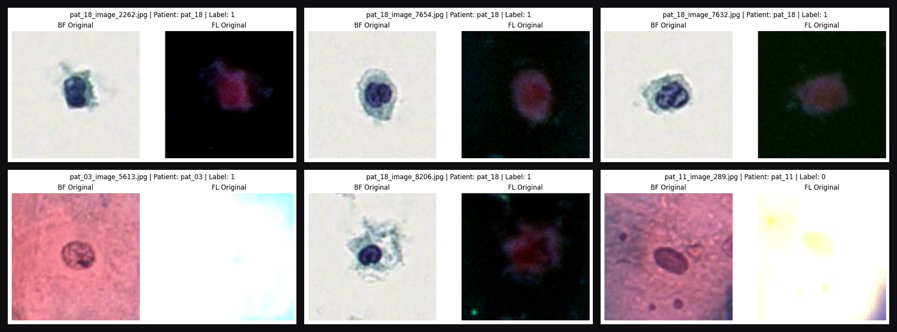
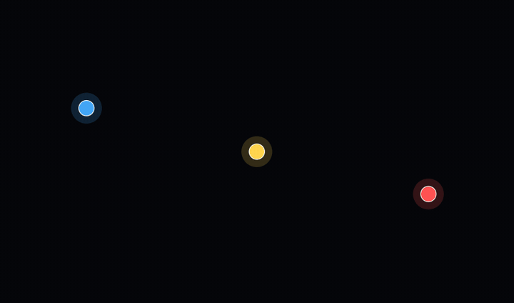

# Samuel Wallace

**@ BMVC 2026 — under review**

MSc Artificial Intelligence @ UZH | ETH · BSc Mathematics (First Class) @ University of Bristol

---

## What I'm up to

Just finished my Master's thesis at the [Robotics and Perception Group (RPG)](https://rpg.ifi.uzh.ch/) at UZH, working on high-temporal-resolution 3D facial tracking using event cameras — fitting a FLAME head model at sub-frame resolution by using the microsecond-level output of neuromorphic sensors to track landmarks between video frames. Captures blinking, jaw movement, and rapid head rotations that standard video completely misses. Submitted to **BMVC 2026** — currently under review.

In August I'm joining **Expedia Group** as a Machine Learning Scientist.

I also TA'd the graduate [Reinforcement Learning course](https://sites.google.com/view/alpi-lab) at UZH.

---

## Projects

**[Event-based Facial Tracking](https://github.com/wallacees12/EFT)** — MSc thesis. Event cameras + ETAP landmark tracking + B-spline fitting + two-pass FLAME optimisation. Beats linear interpolation and TimeLens on FAN landmark error across all rapid motion sequences. `Python` `PyTorch` `Computer Vision`

**[BabelBias](https://github.com/wallacees12/BabelBias)** — Investigating whether LLMs exhibit ingroup bias when prompted in different languages about geopolitically contested events. Embeds Wikipedia articles and LLM responses (GPT, Claude, Gemini) across EN/RU/UK to measure whether each language's response drifts toward its own Wikipedia framing. `Python` `OpenAI` `Anthropic` `Gemini` `NLP` `Embeddings`

**[Synthetic CT Generation](https://github.com/wallacees12/3d-pix2pix-CycleGAN)** — Competed in global competition to push the frontier of MR to CT synthesis in order to improve patient outcomes, streamline treatment and help radiotherapy planning. `Python` `PyTorch` `GAN` `Diffusion` `Transformers` `Computer Vision` `SWIN` 

**[Multimodal Cancer Classification](https://github.com/wallacees12/Multimodal_Cancer_Classification_Challenge_2025)** — Binary cancer cell classification combining bright-field and fluorescence microscopy into 6-channel inputs for a fine-tuned ConvNeXt-Large. Top finish in the UZH challenge. `Python` `PyTorch`

**[GeoGuessr Game](https://github.com/wallacees12/SoPra-Client)** — Full-stack web GeoGuessr-style game built for the UZH Software Practice course. React/TypeScript frontend, Java Spring Boot backend, multiplayer support. `Java` `TypeScript` `React` `Spring Boot`

**[Movie Chatbot (ATAI)](https://github.com/wallacees12/Chatbot_ATAI)** — Knowledge-graph-backed conversational agent for movie Q&A. SPARQL queries over an RDF graph, spaCy NER + hardcoded entity linking, TransE embedding fallback for unseen relations, crowd-sourced answer validation, and a multimedia branch that retrieves IMDb stills. Built for UZH's Advanced Topics in AI course. `Python` `RDF` `SPARQL` `spaCy` `PyTorch`

**[Laplacian Attention](https://github.com/wallacees12/AML-Laplacian-Attention)** — Self-attention variant extending Gaussian attention with Laplacian approximations for improved interpretability. Evaluated on Meta's LLaMA 7B. `Python` `PyTorch` `NLP`

**[OpenMP Parallelisation](https://github.com/wallacees12/OpenMP-Parallelisation)** — High-performance parallel computing in C with OpenMP, including a multi-threaded N-body galaxy simulation (galsim) with per-thread force accumulation and barrier-free reduction. `C` `OpenMP`

**[Sign Language Translator](https://github.com/wallacees12/Sign-Language-Detection)** — Real-time ASL fingerspelling. A feed-forward network classifies MediaPipe hand-keypoint geometry (21 landmarks, 3D) and spells words live from the webcam by holding each letter for one second. >90% accuracy on the keypoint model, vs >75% for a raw-image CNN baseline. `Python` `MediaPipe` `TensorFlow` `Computer Vision`

---

## Skills

Python · PyTorch · Java · C/C++ · TypeScript · R · SQL
Computer vision · generative models · diffusion · event cameras · NLP · reinforcement learning

---

[LinkedIn](https://linkedin.com/in/samuel-fwallace) · [Email](mailto:wallacees12@gmail.com)
